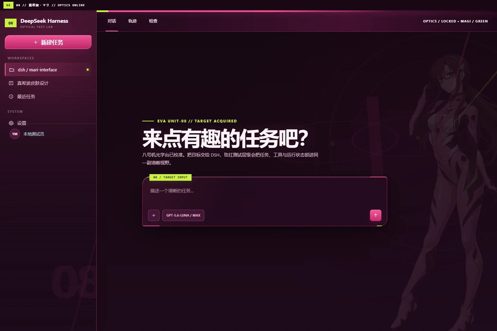

# dsh-skin-mari

An unofficial Mari Makinami / EVA Unit-08 interface skin for the DSH Web UI, built around smoked plum, vivid magenta, acid-green calibration marks, warm ivory, and a dual-lens optical reticle.



## Highlights

- Full-height Mari artwork and Unit-08 optical reticles on the welcome screen.
- Artwork automatically fades, desaturates, and shifts aside during active conversations.
- Deliberate light and dark treatments for settings, menus, terminal surfaces, messages, and disabled states.
- Responsive and reduced-motion behavior.
- Fully reversible DOM, observer, title, favicon, theme-color, and inline layout lifecycle.
- Embedded artwork with no remote runtime dependency.

## Installation

```sh
dsh plugin --profile web add https://github.com/unpain/dsh-skin-mari.git
```

Select `Mari Makinami · UNIT-08` under `Settings > Skins`.

## License and notice

Code is MIT licensed. Mari Makinami and Evangelion belong to their respective rights holders. This is an unofficial fan-made theme and is not affiliated with the rights holders. See [NOTICE](NOTICE).
